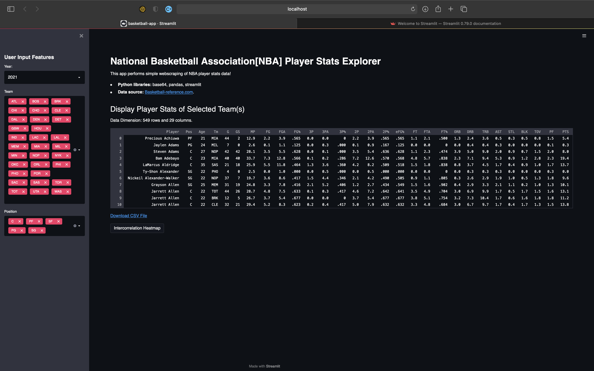
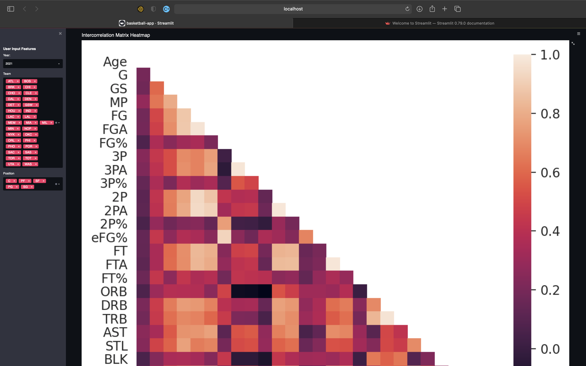
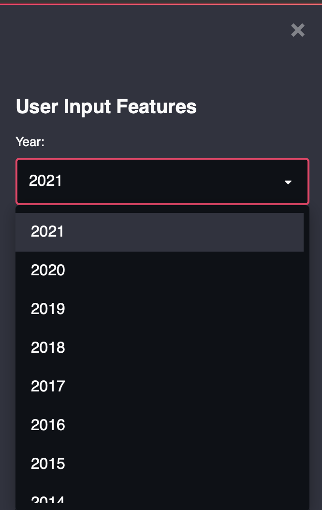
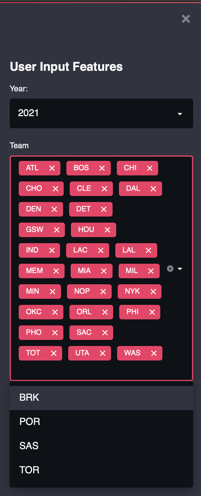
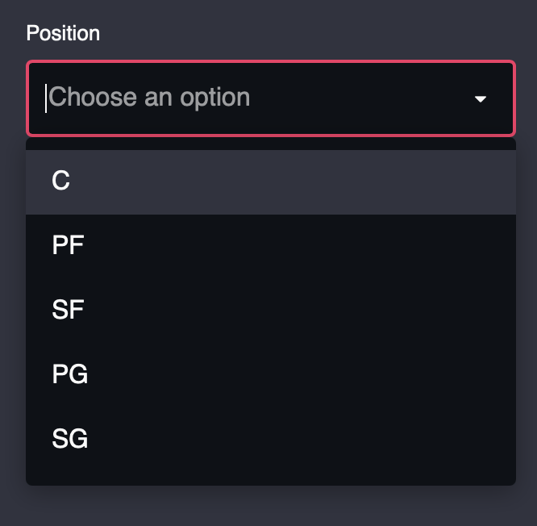

# NBA Teams/Player Data Analysis/Visualization Project

- This is a small static project, built with python which uses Web Scrapping, Streamlit, Numpy, Pandas, Matplotlib, Seaborn, and similar packages to get nba player data, and parse/sort important information to support analysis and visualization.

## Screen shots Of the Running App

### Main Page:

(The client side visible-page)

### Heatmap:

(Heatmap is genrated after clicking on button: Intercorrelation Heatmap)

### Features for data selection to understand correlation

#### Dropdown menu for selecting year:

#### Dropdown menu for Team selection:

#### Droupdown menu for position selection:

# Getting Started with Creating Python App and Running the project on Streamlit Network

We used Streamlit for running our project we can visit \
Local URL: http://localhost:8501 \
Network URL: http://10.0.0.127:8501

# Libraries needed to be installed before running the app:

We have to install few libraries before running this app are

### pip install streamlit

This library is used for building the app on Streamlit.

### pip install numpy && pip install pandas

This library is used for Data Framing and Data Scrapping \
We are going to use 'https://www.basketball-reference.com' website for fatching our data. 

### pip install pybase64

This library is used for running base64 used for downloading csv files. It helps convert ASCII to bytes. 

### pip install seaborn && pip install -U matplotlib

This libraries are used for visualization & creating Heatmaps.

## Run the app

### Streamlit run basketball-app.py 

